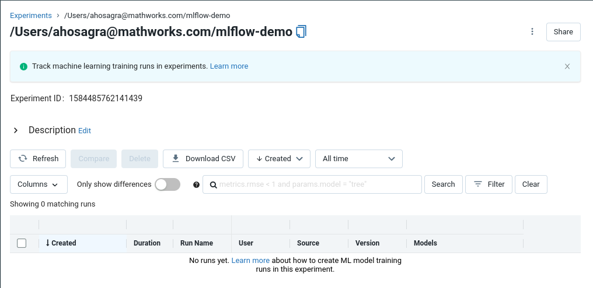
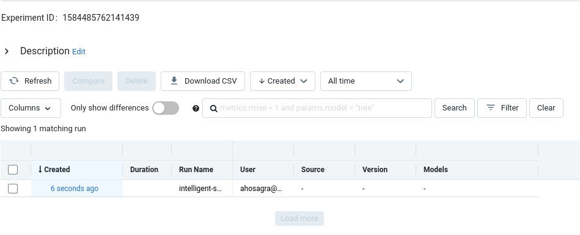
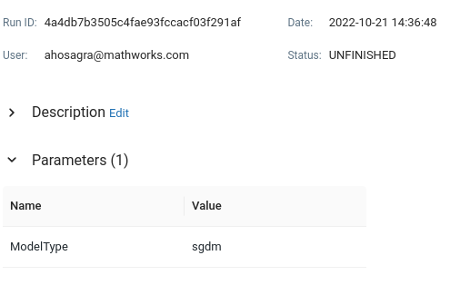
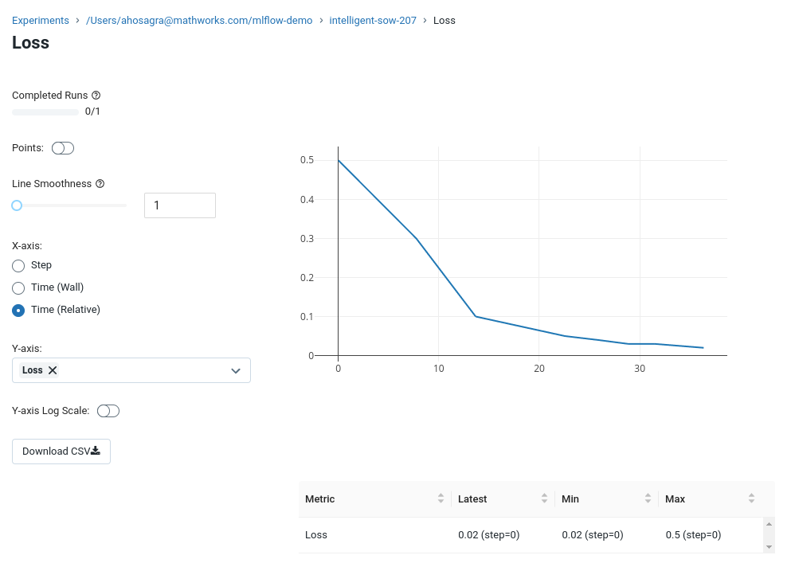

# Quick Start

## Installation

If the package is installed as part of a larger parent package e.g. The MATLAB
*interface for Databricks* any further installation steps that may be required will
be documented as part of the parent package's installation process.

Otherwise if the package is to be used in a standalone capacity extract the package
into an empty directory. Run the `Software\MATLAB\startup.m` function to begin
using the package.

## Authentication

See the [Authentication](Authentication.md) page for more details on how to configure
MLFlow to work with your server. If used as part of a parent package see also
the respective package's authentication documentation.

## Create a new experiment

Create a new experiment using:

```matlab
mle = mlflow.Experiment;
mle.name = '/Users/ahosagra@mathworks.com/mlflow-demo';
mle.create();
```

## Connect to an existing experiment

Connect to an existing experiment using:

```matlab
mle = mlflow.Experiment.getByName('/Users/ahosagra@mathworks.com/mlflow-demo')
```

This returns an `mlflow.Experiment` object:

```matlab
mle = 

  Experiment with properties:

        experiment_id: "1584485762141439"
                 name: "/Users/ahosagra@mathworks.com/mlflow-demo"
    artifact_location: "dbfs:/databricks/mlflow-tracking/1584485762141439"
      lifecycle_stage: "active"
     last_update_time: 1666387710645
        creation_time: 1666387710645
                 tags: [1×5 mlflow.ExperimentTag]
```



## Create a new run for the experiment

Create a new run Object from the experiment using:

```matlab
r1 = mle.createRun();
```

This returns an `mlflow.Run` object:

```matlab
r1 = 

  Run with properties:

               info: [1×1 mlflow.RunInfo]
               data: [1×1 mlflow.RunData]
             run_id: [0×0 string]
            user_id: [0×0 string]
      experiment_id: "1584485762141439"
         start_time: []
    lifecycle_stage: [0×0 string]

```

Running the `create()` method on this object will create the run on MLFlow

```matlab
r1.create();
```



This run handle can be used for subsequent actions on the run.

## Log a parameter

To log a parameter for the existing run:

```matlab
r1.logParameter('ModelType','sgdm');
```



## Log a metric

To log a metric for the existing run:

```matlab
r1.logMetric('Loss',0.5)
r1.logMetric('Loss',0.3)
r1.logMetric('Loss',0.1)
```



## Conclusion

These API calls can be hooked into the Setup and Metrics functions from apps like the experiment manager or from the users scripts.

For more details please checkout the [API](MLflowAPI.md).

[//]: #  (Copyright 2021-2024 The MathWorks, Inc.)
