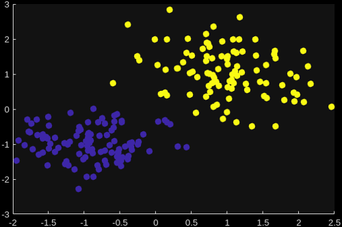

# Usage

When working with MATLAB flavor models there are three main MATLAB functions to work with:

*   {func}`mlflow.matlab.save_model` to save a model in MLflow format to disk
*   {func}`mlflow.matlab.log_model` to log a model in MLflow model format to an MLflow (compatible) server
*   {func}`mlflow.matlab.load_model` to load a model from disk or an MLflow (compatible) server

## MATLAB Functions

```{module} mlflow.matlab
```

````{function} save_model(name=value,...)
Save a MATLAB model to disk in MLflow format. The function can be called with various `name=value` pairs documented below.

**General Name-Value pairs**

:param Path: output path where the model should be saved.

**[](./subflavors/none.md) sub flavor specific Name-Value pairs**

:param MATLABFiles: if set, includes the specified files and directories in the model as-is, this adds those files using the [](./subflavors/none.md) sub flavor.

**[](./subflavors/onnx.md) sub flavor specific Name-Value pairs**

:param Network: if set, saves the model with [](./subflavors/onnx.md) sub flavor. `Network` must be a Deep Learning Toolbox model which is compatible with the [`exportONNXNetwork` function](https://www.mathworks.com/help/deeplearning/ref/exportonnxnetwork.html).

**[](./subflavors/compiler_sdk_python.md) sub flavor specific Name-Value pairs**

:param FunctionFile: if set, saves the model with [](./subflavors/compiler_sdk_python.md) sub flavor. `FunctionFile` then specifies the main MATLAB entrypoint function of the model.

:param NParams: specifies the number of parameters in the function signature of `FunctionFile`. Defaults to `0`.

:param AdditionalFiles: additional MATLAB files and directories to include in the Python package. This is essentially the same option as [`AdditionalFiles` of `PythonPackageOptions`](https://www.mathworks.com/help/releases/R2025b/compiler_sdk/python/compiler.build.pythonpackageoptions.html#mw_0f0e9319-7f78-4934-894f-88b41ab027c8_sep_mw_b0ce0bfc-4349-4175-8c8b-b9dda6c08830).


:param ExampleInputs: cell array of example inputs. When provided this is used to first automatically generate the [function signature definition](./subflavors/compiler_sdk_python.md#workflow-overview) for the specified `FunctionFile`. Can be omitted if a signature YAML-file for the function already exists.

:param ExampleOutputs: cell array of example outputs. Can be used in combination with `ExampleInputs`. If only `ExampleInputs` is set, the function will actually be run with the provided inputs to obtain outputs and then determine the output types. If providing `ExampleOutputs` as well, the function will not be run and the output types will be directly derived from the provided examples.  Can be omitted if a signature YAML-file for the function already exists or if you indeed want the outputs to be determined by running the function.

:param PackageName: sets the package name of the Python module which will be generated when working with the `FunctionFile` option. If unset this default to the filename of `FunctionFile`.

:param ExactDimensions: whether or not to include the exact dimension sizes of the provided example in- and outputs. When set to false, the correct number of dimensions is included with the model but their sizes are all set to `-1`, indicating variable size. Set to `true` if the exact dimension sizes should be derived from the example in- and outputs. Defaults to `false`.

:param IncludeMPSCTF: if set to `true`, apart from the MATLAB Compiler SDK Python module, also build and include a MATLAB Production Server CTF-archive in the saved model. This can only be used in combination with `FunctionFile`. Defaults to `false`.

:param SaveExample: include the provided example input as actual MLflow model example input with the model. Defaults to `true`.

:param: IncludeMATLABMLflowModule: whether or not to include the `matlab_mlflow` Python module inside the model. If the module is included, other MLflow tooling will not have to download the module at runtime. Defaults to `true`.

**Advanced Name-Value pairs**

:param SubFlavor: can be specified to explicitly override which sub flavor to use for saving the model. Setting this is not recommended. Normally the sub flavors are automatically derived from which of the name value pairs above were used. Valid values are: `"none"`,`"onnx"`, or `"compiler_sdk_python"`.

:param MLflowOptions: cell array with additional keyword arguments to pass to the underlying Python functions. 
````


````{function} log_model(name=value,...)
Logs a MATLAB model to an MLflow (compatible) server. The function can be called with various `name=value` pairs documented below.

See [](../InstallationPython.md#mlflow-tracking-servers) to learn more about configuring the tracking URI before logging to a remote server,

**General Name-Value pairs**

:param Path: output path inside the MLflow model inside which the model artifact should be saved. Defaults to `"model"`.

**[](./subflavors/none.md) sub flavor specific Name-Value pairs**

:param MATLABFiles: if set, includes the specified files and directories in the model as-is, this adds those files using the [](./subflavors/none.md) sub flavor.

**[](./subflavors/onnx.md) sub flavor specific Name-Value pairs**

:param Network: if set, logs the model with [](./subflavors/onnx.md) sub flavor. `Network` must be a Deep Learning Toolbox model which is compatible with the [`exportONNXNetwork` function](https://www.mathworks.com/help/deeplearning/ref/exportonnxnetwork.html).

**[](./subflavors/compiler_sdk_python.md) sub flavor specific Name-Value pairs**

:param FunctionFile: if set, logs the model with [](./subflavors/compiler_sdk_python.md) sub flavor. `FunctionFile` then specifies the main MATLAB entrypoint function of the model.

:param NParams: specifies the number of parameters in the function signature of `FunctionFile`. Defaults to `0`.

:param AdditionalFiles: additional MATLAB files and directories to include in the Python package. This is essentially the same option as [`AdditionalFiles` of `PythonPackageOptions`](https://www.mathworks.com/help/releases/R2025b/compiler_sdk/python/compiler.build.pythonpackageoptions.html#mw_0f0e9319-7f78-4934-894f-88b41ab027c8_sep_mw_b0ce0bfc-4349-4175-8c8b-b9dda6c08830).

:param ExampleInputs: cell array of example inputs. When provided this is used to first automatically generate the [function signature definition](./subflavors/compiler_sdk_python.md#workflow-overview) for the specified `FunctionFile`. Can be omitted if a signature YAML-file for the function already exists.

:param ExampleOutputs: cell array of example outputs. Can be used in combination with `ExampleInputs`. If only `ExampleInputs` is set, the function will actually be run with the provided inputs to obtain outputs and then determine the output types. If providing `ExampleOutputs` as well, the function will not be run and the output types will be directly derived from the provided examples.  Can be omitted if a signature YAML-file for the function already exists or if you indeed want the outputs to be determined by running the function.

:param PackageName: sets the package name of the Python module which will be generated when working with the `FunctionFile` option. If unset this default to the filename of `FunctionFile`.

:param ExactDimensions: whether or not to include the exact dimension sizes of the provided example in- and outputs. When set to false, the correct number of dimensions is included with the model but their sizes are all set to `-1`, indicating variable size. Set to `true` if the exact dimension sizes should be derived from the example in- and outputs. Defaults to `false`.

:param IncludeMPSCTF: if set to `true`, apart from the MATLAB Compiler SDK Python module, also build and include a MATLAB Production Server CTF-archive in the logged model. This can only be used in combination with `FunctionFile`. Defaults to `false`.

:param SaveExample: include the provided example input as actual MLflow model example input with the model. Defaults to `true`.

:param: IncludeMATLABMLflowModule: whether or not to include the `matlab_mlflow` Python module inside the model. If the module is included, other MLflow tooling will not have to download the module at runtime. Defaults to `true`.

:param RegisteredModelName: when set also immediately registers the model as registered model under the specified name.

**Advanced Name-Value pairs**

:param SubFlavor: can be specified to explicitly override which sub flavor to use for logging the model. Setting this is not recommended. Normally the sub flavors are automatically derived from which of the name value pairs above were used. Valid values are: `"none"`,`"onnx"`,or `"compiler_sdk_python"`.

:param MLflowOptions: cell array with additional keyword arguments to pass to the underlying Python functions. 
````

```{function} load_model(source,destination)
Returns the location of (a local copy of) the specified MATLAB flavor MLflow model. Since MATLAB (MLflow) models are typically simply just a collection of files this does not involve and real loading (into memory), instead the function simply returns the location on local disk such that you can then `cd` to this location or `addpath` the directories to the MATLABPATH. Nevertheless the function is called `load_model` to be in line with other MLflow flavors.

When `source` is a model which is already located on local disk, by default the original location is simply returned, no copies are made. If you do wish a copy to be made, also specify `destination`.

When `source` is a remote model on an MLflow (compatible) server, the model is first downloaded to a local location. Specify `destination` if you wish to specify where the local copy should be located. If `destination` is omitted a temporary location is 
automatically generated.

See [](../InstallationPython.md#mlflow-tracking-servers) to learn more about configuring the tracking URI before loading from a remote server,

:param source: location of the model to load. This can be a local path on disk or refer to MLflow server style `model:` or `run:` URIs or even custom URI schemes provided by MLflow custom storage plugins e.g. `azureml:` (if the relevant plugin is installed in the [MATLAB Python environment](../InstallationPython.md#python-environment)).

:param destination: for local models, specifies in which location a copy of the model should be made first. For remote models specifies to which location the model should be downloaded first. If omitted for local models, no copy is made and simply the original location is returned. If omitted for remote models, the model is downloaded to a automatically generated temporary location first.

:returns: the location of the local (copy) of the model.
```

## Example


### MATLAB Function

In this example we use a MATLAB function as the model which we want to work with in MLflow:

```matlab
function tOut = myClustering(tIn,replicates)
% CLUSTER clusters the data from the input table into two clusters.
%
%  Input table tIn is expected to have two columns: X and Y. The output
%  table is a copy of the input table with an additional column "index"
%  appended which indicates the cluster which the data row belongs to.
%
%  Parameter replicates configures how many replicates kmeans will use.

% Copy the input to the output
tOut = tIn;

% Perform the clustering and append the result as additional column
tOut.index = kmeans(tIn{:,["X","Y"]},2,'Distance','cityblock',...
    'Replicates',replicates);
```

This function can cluster data from an input table into two clusters. And in MATLAB it can for example be used as follows:

```matlabsession
% Generate example input data
>> tIn = table;
>> tIn.X = [randn(100,1)*0.75+ones(100,1); randn(100,1)*0.5-ones(100,1)];
>> tIn.Y = [randn(100,1)*0.75+ones(100,1); randn(100,1)*0.5-ones(100,1)];

% Call the function
>> tOut = myClustering(tIn,5)

tOut =

  200×3 table

       X            Y        index
    ________    _________    _____

      1.2491      0.73961      2  
     -0.3184       1.2484      2  
      1.3544      0.36121      2  
      1.5996      0.54201      2  
     0.40121      0.53412      2  

       :            :          :  

     -1.4744      -1.1326      1  
     -1.1056     -0.57115      1  
     -1.4302     -0.72716      1  
    -0.59563    -0.073124      1  
    -0.75538     -0.50195      1  
```

Further, you could then visualize the results using:

```matlabsession
>> scatter(tOut.X,tOut.Y,50,tOut.index,"filled")
```




### MATLAB MLflow Model

Now one of the things we can do with this function is log it on our MLflow server as MATLAB code that can later be used in MATLAB again. In this example we use a local server running at `http://localhost:5000`. To instruct MATLAB to work with this we can use:

```matlabsession
>> mlflow.set_tracking_uri("http://localhost:5000")
```

> _Or alternatively this can also be configured using environment variable `MLFLOW_TRACKING_URI`._


Further, when you want to log a model you do that as part of a run in a particular experiment. This is especially useful if your model needs to be trained, you can then track how the model was trained exactly (e.g. with which parameters and which data). Now that is not the case for our model here, but we will still want to follow this MLflow convention. So we first set an experiment and start a run using the [Fluent Interface](../Fluent.md):

```matlabsession
>> mlflow.set_experiment("My MATLAB Clustering Model")
>> mlflow.start_run()
```

And then we can use `mlflow.matlab.log_model` to log the model. Since we already know we want to be able to easily re-use this model we will also immediately register it as a registered model:

```matlabsession
>> mlflow.matlab.log_model(MATLABFiles="myClustering.m",RegisteredModelName="myMATLABClustering");
Successfully registered model 'myMATLABClustering'.
2026/03/13 11:40:17 INFO mlflow.store.model_registry.abstract_store: Waiting up to 300 seconds for model version to finish creation. Model name: myMATLABClustering, version 1
Created version '1' of model 'myMATLABClustering'.
```

```{hint}
If you are not sure yet whether your model in question should really become a registered model, you can simply omit the entire `RegisteredModelName` option. You can then still later register the model, you do not have to "re-log" the model for this.
```

After that we end the run:

```{code} matlabsession
:name: endrun

>> mlflow.end_run()
🏃 View run delicate-mink-467 at: http://localhost:5000/#/experiments/1/runs/11c3fb2acf1a489c8727f905a1b42c87
🧪 View experiment at: http://localhost:5000/#/experiments/1
```

Now let's say that some time later, you want to re-use this model in MATLAB. Then, since we registered the model, we can easily get to it using a `models:/` MLflow URI:

```matlabsession
>> loc = mlflow.matlab.load_model("models:/myMATLABClustering/1")

loc = 

    "/tmp/tmpa7swg9y_/matlab"
```

As we can see this returned a (temporary) location on disk which the model got downloaded to, and if we look at that location we indeed see our MATLAB function there:

```matlabsession
>> ls(loc)
myClustering.m
```

We can now copy this elsewhere, use `addpath` to add this location to the MATLABPATH, or just `cd` to the location and work with the function there. Alternatively we could also have provided a second input to `load_model` to specify the location which the model should be downloaded to.

````{hint}
If we would not have registered the model as a registered model, we could not have easily accessed it by its name but it can still be accessed by its ID (`models:/EnterModelIdHere`). Where this model ID could for example be found through the MLflow server web interface or programmatically by querying the run:

```matlabsession
>> r = mlflow.get_run('11c3fb2acf1a489c8727f905a1b42c87');
>> r.outputs.model_outputs{1}.model_id

ans = 

  Python str with no properties.

    m-8e8937c7c57a4099ad0605d619b1d9e4
```

Where the run ID `11c3fb2acf1a489c8727f905a1b42c87` was returned when we called `mlflow.end_run()`, [see above](#endrun). If you no longer have the run ID either, you could try searching for it:

```matlabsession
>> runs = mlflow.search_runs(experiment_names={"My MATLAB Clustering Model"});
>> runs.table

ans =

  1×10 table

                  run_id                  experiment_id      status                                artifact_uri                                   start_time               end_time          tags.mlflow.source.type    tags.mlflow.user    tags.mlflow.source.name    tags.mlflow.runName 
    __________________________________    _____________    __________    ________________________________________________________________    ____________________    ____________________    _______________________    ________________    _______________________    ____________________

    "11c3fb2acf1a489c8727f905a1b42c87"         "1"         "FINISHED"    "mlflow-artifacts:/1/11c3fb2acf1a489c8727f905a1b42c87/artifacts"    13-Mar-2026 14:48:32    13-Mar-2026 14:48:43            "LOCAL"                "user"                   ""               "delicate-mink-467"
```

````

### Pyfunc compatible MLflow Model

But what if we want this model to also be useable outside of MATLAB? For example in Python or by hosting it as RESTful endpoint using [MLflow model serving](https://mlflow.org/docs/latest/api_reference/cli.html#mlflow-models-serve). In that case we can log our model with the [](./subflavors/compiler_sdk_python.md) by using:

```matlab
% Start a run
mlflow.set_experiment("My MATLAB Clustering Model");
mlflow.start_run();

% Generate an example input
tIn = table;
tIn.X = [randn(100,1)*0.75+ones(100,1); randn(100,1)*0.5-ones(100,1)];
tIn.Y = [randn(100,1)*0.75+ones(100,1); randn(100,1)*0.5-ones(100,1)];

% Use mlflow.matlab.log_model to log the model
mlflow.matlab.log_model( ...
    ... This time we use FunctionFile to indicate that we want to create a
    ... compiler_sdk_python sub flavor model with this function as main 
    ... entry point
    FunctionFile="myClustering.m", ...
    ... To be able to create such kind of models, the in- and output data
    ... types must be known. The easiest way to specify this is by
    ... providing example inputs, we provide the example table as input
    ... as well as a value for the "replicates" parameter
    ExampleInputs={tIn,5},...
    ... Further we need to specify how many of such parameters there are
    NParams=1,...
    ... Finally we also register this model as registered model
    RegisteredModelName="myClustering")

% end the run
mlflow.end_run();
```

Now this model is not really reusable inside MATLAB, it only contains the generated Python package and we chose not to include the original MATLAB code as well. So let's switch to Python to call the model. Before we can do that though; it is important to note that [the MATLAB Runtime is required at runtime](./subflavors/compiler_sdk_python.md#matlab-runtime-requirements), so make sure it is installed and `PATH` or `LD_LIBRARY_PATH` are configured correctly before starting Python. Once we have done that, we can run the following inside Python:

```python-console
>>> # Import the MLflow module
>>> import mlflow
>>> # Configure the tracking URI
>>> mlflow.set_tracking_uri("http://localhost:5000")
>>> # Load the model
>>> model = mlflow.pyfunc.load_model("models:/myClustering/1")
>>> # Since the input example is also saved with the model, see:
>>> model.input_example
            X         Y
0    0.713541  0.945551
1   -0.028403  1.569334
2    1.007731  0.938752
3    1.153099  0.881145
4    0.691731  1.004874
..        ...       ...
195 -1.690718 -0.887948
196 -0.435860 -1.233068
197  0.232720 -1.166043
198 -1.778959 -0.537593
199 -2.033324 -0.276487

[200 rows x 2 columns]
>>> # We can easily reuse it to quickly call the model
>>> result = model.predict(model.input_example,params={'replicates':5.0})
>>> # And see the result
>>> result
            X         Y  index
0    0.713541  0.945551    1.0
1   -0.028403  1.569334    1.0
2    1.007731  0.938752    1.0
3    1.153099  0.881145    1.0
4    0.691731  1.004874    1.0
..        ...       ...    ...
195 -1.690718 -0.887948    2.0
196 -0.435860 -1.233068    2.0
197  0.232720 -1.166043    2.0
198 -1.778959 -0.537593    2.0
199 -2.033324 -0.276487    2.0

[200 rows x 3 columns]
```

Or instead of calling the model from Python, we can also use the MLflow model serving feature to host the model. Again this requires a MATLAB Runtime to be available, make sure it is configured before running the following to serve the model:

```console
$ export MLFLOW_TRACKING_URI=http://localhost:5000
$ mlflow models serve -m 'models:/myClustering/1' --port 5001 --env-manager uv
```

> _Where you can replace `uv` with the [environment manager](https://mlflow.org/docs/latest/api_reference/cli.html#cmdoption-mlflow-models-build-docker-env-manager) of your choice._

After which we can for example use `curl` to call the `/invocations` endpoint. This requires an [input body in the correct format](https://mlflow.org/docs/latest/ml/deployment/deploy-model-locally/#accepted-input-formats) and for our model here, this will look something like:

```json
{
  "dataframe_split": {
    "columns": [
      "X",
      "Y"
    ],
    "data": [
      [
        0.7135410595364997,
        0.9455510008911132
      ],
      [
        -0.028403127622235624,
        1.5693335801546189
      ],
      …
    ]
  },
  "params": {
    "replicates": 5.0
  }
}
```

Luckily the package generated such an input based on the example MATLAB input which we provided. It will have created a file named `serving_input_example.json` next to the MATLAB code. We can use that file as an input to `curl` to invoke the model:

```console
$ curl http://localhost:5001/invocations -H "Content-Type: application/json" --data @serving_input_example.json
{"predictions": [{"X": 0.7135410595364997, "Y": 0.9455510008911132, "index": 1.0}, …
```


[//]: #  (Copyright 2025-2026 The MathWorks, Inc.)